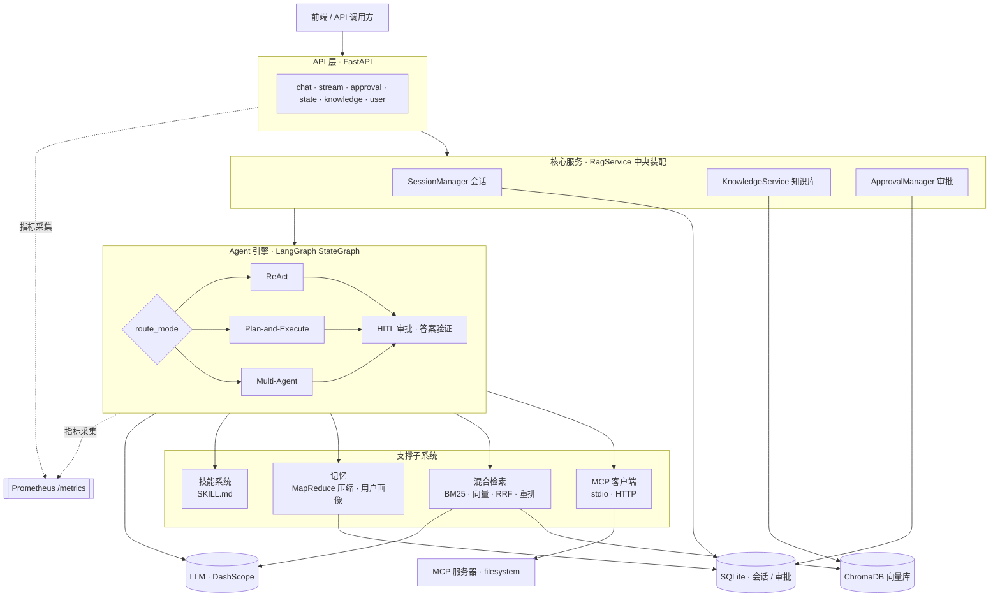
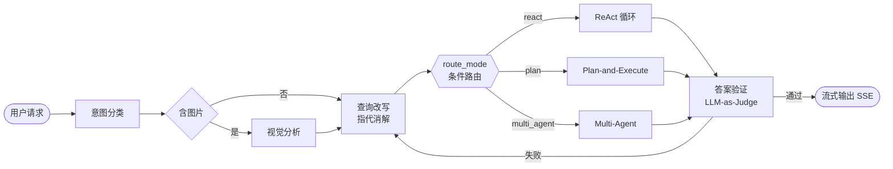
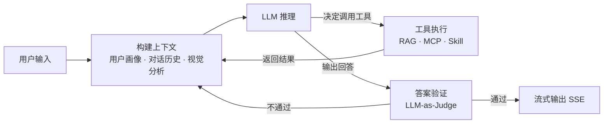
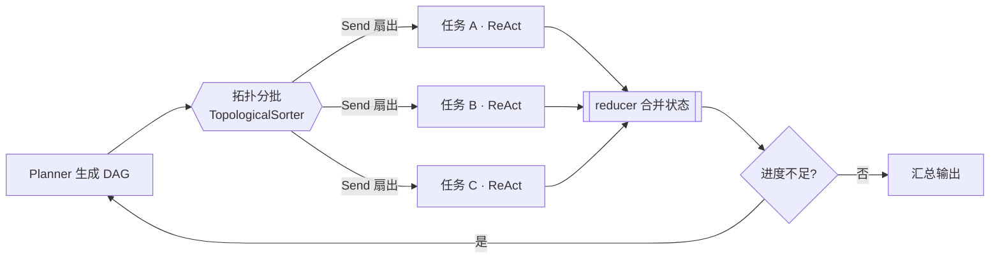
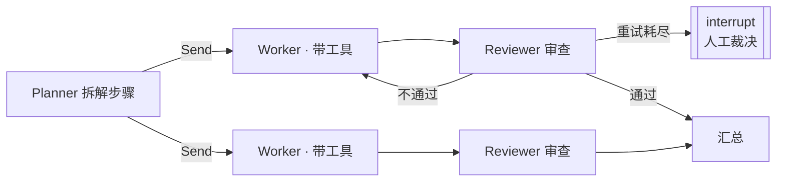
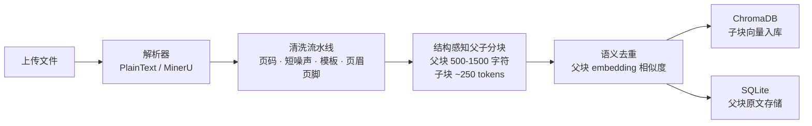
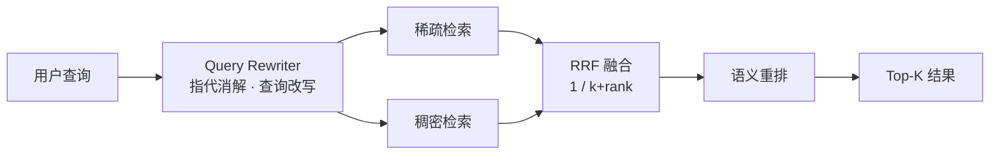

# Zagent


Zagent 是一个基于 LangGraph 的 RAG 引擎：Agent 自己决定什么时候检索、用哪个工具、检索几次。用户请求经意图分类、多模态视觉理解、查询改写后，由条件路由分派到 ReAct、Plan-and-Execute、Multi-Agent 三种执行模式；工具调用通过 MCP 协议接入外部能力，受人机回圈门控；长会话由 MapReduce 异步压缩控制上下文膨胀；内置 Prometheus 可观测。

---

## 快速开始

### 1. 克隆并安装

```bash
git clone https://github.com/opase/Z-Agent.git
cd Z-Agent-main
cp .env.example .env
```

编辑 `.env`，填入你的 DashScope API Key ：

```env
DASHSCOPE_API_KEY=sk-xxxxxxxxxxxxxxxx
```

安装依赖：

```bash
pip install -r requirements.txt
```

### 2. 启动服务

```bash
uvicorn main:app --host 127.0.0.1 --port 8080
```

服务默认监听 `http://127.0.0.1:8080`。访问 `/health` 确认运行状态，`/docs` 查看 Swagger 文档。

### 3. 运行测试

```bash
python -m pytest tests/ -v
```

### 4. 前端（可选）

```bash
cd frontend
pnpm install
pnpm dev
```

前端开发服务器默认监听 `http://localhost:5173`，API 请求会自动代理到后端。

> **生产部署注意：**
> - **认证：** 本项目不含内置认证机制，`user_id` 由客户端传入。生产环境请自行添加 auth 中间件（如 OAuth2 Proxy、API Gateway 等）。
> - **Checkpoint：** 当前 LangGraph checkpoint 使用 `MemorySaver`（内存存储），进程重启后图执行状态会丢失。生产环境建议替换为 Redis 或 Postgres checkpointer（见 `core/session_store.py` 的 `SessionStore` 抽象基类）。MCP 审批记录已持久化到 SQLite，重启不影响审批恢复。

---

## 主要功能

Zagent 围绕 Agent 引擎和配套支撑设施展开，主要功能如下。

### 三种执行模式：ReAct / Plan / Multi-Agent

由条件路由 `route_mode` 自动分派，默认 `auto` 按任务复杂度自动升级，也可以由请求显式指定。

- **ReAct：** 单 Agent「思考、调用工具、观察」循环，适合常规问答与工具调用。
- **Plan-and-Execute：** 先由规划器生成任务 DAG，再用 LangGraph 并行执行子任务，适合多步骤复杂任务。
- **Multi-Agent：** Planner、Worker、Reviewer 多角色协作，适合高质量要求场景。

### 长短期记忆 + Token 感知压缩

- **短期记忆：** 会话 token 占用达到阈值时触发 MapReduce 异步压缩——并行分块摘要（Map），合并并替换旧摘要（Reduce），配合硬截断安全网，防止长会话上下文膨胀。
- **循环内上下文压缩：** ReAct / Plan / Multi-Agent 执行循环在每次调用 LLM 前按估算 token 评估，超阈值即把较早的工具往返摘要，只保留最近几轮，且保证 `tool_call`/`tool_result` 配对不被切断。
- **长期记忆：** 压缩时抽取持久化事实，保存用户画像（属性、偏好），跨会话复用。
- 压缩任务异步调度、不阻塞请求，使用轻量模型降低成本；窗口与触发阈值可配。

### MCP 工具生态 + 人机回圈（HITL）

- **MCP 接入：** 通过模型上下文协议（Model Context Protocol）接入外部工具，支持 stdio / Streamable HTTP 双传输。
- **人机回圈：** 工具调用可配置为需人工批准，支持批准、拒绝、全部批准。
- 审批策略在 YAML 中声明式配置，可精确到工具级覆盖 + 服务器级默认。

### 可插拔技能系统（Skill）

- 以 SKILL.md（Markdown frontmatter）声明式定义可复用的决策知识。
- 三层目录 builtin、user、project 同名覆盖，团队、个人、项目分层管理。
- LLM 按需调用 `load_skill` 注入上下文（渐进式披露），LRU 缓冲控制上下文长度。

### 混合检索 RAG

- 稀疏检索（BM25）与稠密检索（向量）经 RRF 融合，再用重排模型排序。
- 稀疏与稠密双路召回，兼顾关键词精准匹配与语义泛化。

### Prometheus 可观测

- 内置业务指标：对话、SSE 事件、LLM 耗时、工具调用、ReAct 轮数、审批、检索、MCP 连接、知识库等。
- 通过 `/metrics` 自动暴露，配合请求追踪中间件实现全链路可观测。

---

## 架构总览

### 系统架构



### 请求主流程



### 分层职责

| 层 | 目录 | 职责 |
|----|------|------|
| **API** | `api/` | FastAPI 路由、请求校验、SSE 结构化流式、审批恢复、线程状态查询 |
| **Agent 引擎** | `agent/` | LangGraph 状态机、三种执行模式、HITL 审批、工具执行、答案验证、视觉分析 |
| **MCP 集成** | `mcp_client/` | 模型上下文协议双传输、JSON Schema 裁剪、工具命名空间注册、惰性重连 |
| **检索** | `retrieval/` | 稀疏与稠密混合检索、RRF 融合、语义重排 |
| **记忆** | `memory/` | Token 感知的短期 MapReduce 压缩、ReAct 循环内上下文压缩、长期画像持久化、上下文查询改写 |
| **技能** | `skill/` | SKILL.md 解析、三层注册、上下文注入缓冲 |
| **核心服务** | `core/` | RAG 中央装配、知识库、会话管理、SQLite 持久化、Prometheus 指标 |
| **配置** | `config/` | 集中配置与环境变量覆盖、MCP 声明式 YAML |
| **评测** | `evaluation/` | RAG 端到端评估（检索指标与 LLM-as-Judge） |

---

## Agent 引擎

主图由 `route_mode()` 条件边分派，复杂任务自动升级到 `plan`，也可由请求显式指定。

| 模式 | 适用场景 | 机制 |
|------|----------|------|
| `react` | 常规问答、工具调用 | 单 Agent「思考、调用工具、观察」循环（上限 5 轮） |
| `plan` | 多步骤复杂任务 | 先规划出 DAG，再并行执行子任务 |
| `multi_agent` | 高质量要求任务 | 多角色协作、质量审查、人工兜底 |

### ReAct



- 单 Agent 循环：LLM 自主决定调用工具或输出回答，每次工具结果回灌上下文后继续推理。
- 工具执行前触发 HITL 审批检查，MCP 工具可配置需人工批准。
- 上限 5 轮，超过后强制基于已有信息生成回答。

### Plan-and-Execute



- `Task` 与 `ExecutionPlan` 数据类，`get_execution_batches()` 用标准库 `TopologicalSorter` 拓扑分批。
- `Send("execute_task", payload)` 把当前批次的就绪任务动态扇出为并行子图实例。
- `Annotated[dict, merge_tasks]` reducer 自动合并并行分支返回的任务状态。
- 进度不足触发 `replan()` 重规划；规划失败降级为单任务计划。

### Multi-Agent



- `AgentRole.PLANNER / WORKER / REVIEWER` 三种角色，`SubAgent` 各持独立对话历史。
- Worker 有工具权限，Reviewer 纯推理审查（LLM-as-Judge）。
- 审查失败自动重试（不超过 2 次），耗尽后 `interrupt("review_escalation")` 升级人工。

---

## MCP 与 HITL

### MCP 客户端

- **双传输：** `StdioTransport`（asyncio 子进程 + JSON-RPC，带心跳）、`HttpTransport`（aiohttp + SSE 端点自发现）。
- **Schema 裁剪**（`schema.py`）：展开 `$ref`、展平 `oneOf`/`anyOf`、移除不支持的关键字，转为 LangChain `bind_tools` 兼容格式。
- **注册表**（`registry.py`）：命名空间 `mcp__{server}__{tool}`，审批策略遵循「工具级覆盖优先于服务器级默认」。
- **连接管理**（`manager.py`）：从 YAML 启动全部服务器、`call_tool()` 断开惰性重连、优雅关闭子进程。

### 三层审批

| 层级 | 触发点 | 机制 |
|------|--------|------|
| **Plan Review** | 计划执行前 | `interrupt("plan_review")` |
| **Tool Approval** | MCP 工具调用前 | `asyncio.Event` 原地等待（不重启节点） |
| **Review Escalation** | Multi-Agent 审查耗尽 | `interrupt("review_escalation")` |

- 审批记录持久化到 SQLite（`approval_requests` 表，与会话库共享），支持自动过期与崩溃标记。
- 图编译挂载 `MemorySaver` checkpoint，重启后可恢复中断点。

---

## 混合检索 RAG

### 文档摄取流水线（Ingestion Pipeline）



- **解析**（`retrieval/document_parser.py`）：可插拔设计，默认 `PlainTextParser` 处理 `.txt/.md`，可选 `MinerUParser` 支持 PDF/DOCX/PPTX（本地 CLI 或云端 API）。
- **清洗**（`retrieval/cleaners.py`）：四级过滤器串行——独立页码行、无意义短噪声、版权声明模板文本、重复页眉页脚。
- **父子分块**（`retrieval/chunker.py`）：5 级降级（标题→段落→句子→标点→硬切），父块送 LLM，子块做向量检索。
- **语义去重**（`retrieval/deduplicator.py`）：父块级 cosine 相似度去重（阈值 0.92），子块级 MD5 精确去重。

### 检索流程



- **查询改写**（`memory/query_rewriter.py`）：指代消解与上下文补全，将"它呢""那个怎么样"还原为完整查询。
- **双路召回**（`retrieval/bm25.py` + `retrieval/vector.py`）：稀疏检索（BM25）关键词匹配 + 稠密检索（ChromaDB embedding）语义匹配，互补覆盖。
- **RRF 融合**（`retrieval/vector.py`）：`rrf_k=60`，融合稀疏与稠密两路排序结果。
- **语义重排**（`retrieval/reranker.py`）：`gte-rerank-v2` 对候选集精排，输出最终 Top-K。

---

## 记忆系统：Token 感知的分层压缩

两层压缩协同控制上下文膨胀，触发均以估算 token 为准（中文约 1.5 字/token、其余约 4 字符/token）。

### 短期会话记忆压缩（MapReduce）

`memory/conversation.py` 在短期记忆 token 占用达到阈值（`窗口 × 0.45 × 0.9`）时异步压缩：

1. 保留最近 3 轮对话不压缩。
2. **Map：** 溢出消息按每块 5 条分块，`asyncio.gather()` 并行摘要。
3. **Reduce：** 多块合并；旧摘要被替换而非累加（根治无限增长）。
4. **安全网：** 摘要硬截断上限 800 字符。
5. 压缩时经 `LongTermMemory.extract_facts()` 抽取持久化事实，并在 Python 层二次过滤临时性、推测性内容。
6. `create_task()` 异步调度不阻塞请求；已有压缩任务运行时跳过（并发保护）；`SessionManager.safe_remove()` 等待压缩完成再删除。

### ReAct 循环内上下文压缩

`memory/token_budget.py` 保护单轮执行真正发给 LLM 的消息列表：在每次调用 LLM 前估算 token，超阈值（`窗口 × 0.9`）时把较早的工具往返交给轻量模型摘要，只保留最近几轮工具交互。分割点落在"工具调用轮"边界，保证 `tool_call` / `tool_result` 配对不被切断；已接入 ReAct / Plan / Multi-Agent 三个执行循环。

> 压缩使用轻量模型，长期画像按用户唯一标识持久化为 JSON。窗口大小、触发率、保留轮数等在 `config/settings.py` 可配，支持环境变量覆盖（如 `MODEL_CONTEXT_WINDOW`）。

---

## 可插拔技能系统（Skill）

- **解析**（`skill/parser.py`）：零依赖解析 `---` frontmatter 与正文（支持单行、多行 `|` 块、行内数组）。
- **三层注册**（`skill/registry.py`）：`builtin` → `user`（`~/.zagent`）→ `project`（`.zagent`），后者同名覆盖前者。
- **工具：** `load_skill` 与 `list_skills` LangChain 工具；`SkillContextBuffer` 每线程独立、LRU 淘汰（不超过 3 个）、system prompt 索引受预算约束。

---

## 可观测性与工程化

- **Prometheus 指标**（`core/metrics.py`）：覆盖对话、SSE 事件、LLM 耗时、工具调用、ReAct 轮数、验证结果、审批、检索、MCP 连接、知识库等维度指标；由 `prometheus-fastapi-instrumentator` 自动暴露 `GET /metrics`。
- **请求追踪：** `X-Request-ID` 中间件与全链路耗时日志。
- **持久化**（`core/session_store.py`）：SQLite（WAL + 外键）四张表 `sessions`、`messages`、`session_summary`、`approval_requests`；`MemoryStore` 抽象基类可替换为 Redis 或 Postgres。
- **降级矩阵：** Embedding、Reranker、Planner、Verifier、Vision、MCP、记忆压缩均有明确兜底策略，单点失败不拖垮主链路。

---

## 技术栈

| 层 | 技术 |
|----|------|
| 后端 | Python、FastAPI |
| Agent 编排 | LangGraph、LangChain |
| 检索 | ChromaDB、rank-bm25 |
| 工具协议 | MCP |
| 持久化 | SQLite |
| 可观测 | Prometheus |
| 前端 | React、Vite、TypeScript、Tailwind CSS |
| 测试 | pytest |

---

## 项目结构（后端）

```
├── main.py                 # FastAPI 入口：服务装配、中间件、路由、MCP 启停
├── config/
│   ├── settings.py         # 集中配置（环境变量覆盖）
│   └── mcp_config.yaml     # MCP 服务器声明式配置
├── api/                    # HTTP 层：chat / approval / state / knowledge / user
├── agent/
│   ├── graph.py            # LangGraph 主图（三模式路由、HITL、验证）
│   ├── planner.py          # 规划器
│   ├── plan_schema.py      # Task / ExecutionPlan DAG、拓扑排序、reducer
│   ├── plan_executor.py    # Plan-and-Execute
│   ├── orchestrator.py     # Multi-Agent
│   ├── roles.py            # 角色定义与独立对话历史
│   ├── approval.py         # 审批管理器
│   ├── router.py           # 意图路由与 Prompt 模板
│   ├── tools.py            # 内置工具与 MCP 工具动态注册
│   ├── verifier.py         # 答案质量验证
│   └── vision.py           # 多模态视觉分析
├── mcp_client/
│   ├── transport/          # stdio / http 双传输与抽象基类
│   ├── schema.py           # JSON Schema 裁剪
│   ├── registry.py         # 工具注册与审批策略
│   └── manager.py          # 连接管理与惰性重连
├── retrieval/              # embedding / bm25 / vector (RRF) / reranker
├── memory/                 # conversation (MapReduce) / token_budget (循环内 token 压缩) / long_term / user_profile / query_rewriter
├── skill/                  # parser / registry / tool / buffer（SKILL.md 技能系统）
├── core/                   # rag_service / knowledge_service / session_* / approval_store / metrics
├── evaluation/             # RAG 评测（检索指标与 LLM-as-Judge）
└── tests/                  # pytest（12 个文件、147 个用例）
```

---

## 未来规划

> 已识别但尚未落地的方向，也是本项目当前的已知边界。

- [ ] **知识库权限管理：RBAC + ABAC** — 当前知识库是全局单库、所有用户共享，无访问隔离。计划引入基于角色的访问控制（RBAC）与基于属性的访问控制（ABAC）：RBAC 管「谁能查询 / 上传 / 管理哪些知识库」，ABAC 按文档属性（部门、密级、标签等）做动态过滤与行级授权，支持多租户隔离。
- [ ] **向量库迁移 Qdrant** — 当前使用 ChromaDB（本地持久化）。计划支持 Qdrant，获得水平扩展、payload 过滤检索与生产级运维能力；检索层已做抽象，可平滑切换后端。
- [ ] **Redis 持久化 Checkpoint 与记忆** — 当前 LangGraph 使用 `MemorySaver`（内存 checkpoint），进程重启后图执行状态会丢失（目前仅靠 SQLite 审批记录恢复审批 UI）。计划将 checkpoint 与记忆快照落到 Redis，实现服务崩溃或重启后从最近快照恢复，配合已有的 `interrupt` / `resume` 达成真正的断点续跑。
- [ ] **自进化：复杂方法沉淀为 Skill** — 当前 SKILL.md 由人工编写。计划让 Agent 从成功的复杂任务轨迹（Plan-and-Execute / Multi-Agent 的规划与执行过程）中自动提炼可复用解法，沉淀为新的 SKILL.md；下次遇到同类任务直接 `load_skill` 复用而非从零规划，形成「执行、反思、沉淀、复用」的自我进化闭环。
